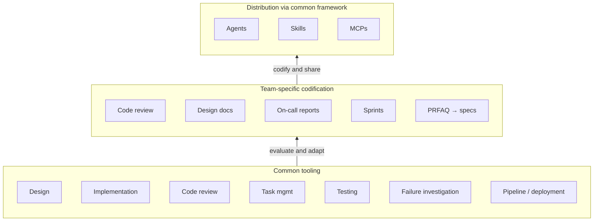

*this writing was co-authored with AI*

Over the past several months, my team within AWS has been running an experiment: adopting AI-native practices in how we build, not just in what we build. 
This post is about what we've learned (thus far). Not a framework. Not a maturity model. Just observations from a team that decided the only way to form real opinions about AI-native SDLC was to actually do it.
The adoption wasn't always organic. There was skepticism — some of it well-founded. There is no single right way to do this. 
But we felt strongly that you can't evaluate a new way of working from the sidelines. 
You have to get your hands dirty, see what works, see what doesn't, and figure out what needs to change. Trying is the strategy.

One note before we go further: I'm intentional about not sharing specific metrics in this post. Numbers stripped of context get passed around as evidence for conclusions they were never meant to support. What I can share is the shape of what we did and learned. Those are more useful to another team figuring out their own path than any percentage would be.

### The skepticism is real — and it's not unreasonable

Let me be clear about something upfront: the skepticism around AI-assisted development (or anything) isn't irrational. When someone on your team says "I tried XXXXX and it hallucinated an API that doesn't exist," they're not being a Luddite. They're reporting a real experience. When a senior engineer says "I'm faster without it," they might be right — for now, for their workflow, for the kind of work they do.

The mistake isn't skepticism. The mistake is letting skepticism become a conclusion before it's been tested as a hypothesis.

### There's no one right way to adopt

Many blog posts hand you a neat adoption framework with phases and gates. I'm not going to do that, because it would be dishonest. We didn't follow one. What we did instead was **establish a few principles**: 

* We would try AI-native practices across real work, not sandboxed experiments. Toy problems produce toy insights.

* We would make adoption voluntary but visible. Nobody was forced to use any specific tool or workflow. But we asked everyone to share what they tried, what worked, what didn't. The visibility mattered more than the mandate.

* We would treat our observations as data, not verdicts. "This didn't work for code reviews" isn't a permanent conclusion — it's a data point from a specific tool, at a specific point in time, applied to a specific kind of review. The tools are changing fast. Our conclusions need to be held loosely.

### What we tried

**Borrowed before we built**: We didn't start from scratch. Amazon's internal builder tools team maintains a reference of available AI-assisted tooling, organized around the phases of the software development lifecycle. We started there, picking up what was available and applying it to real work. Number of borrowed tools worked quite well (and still is). Where borrowed tooling worked well were in generic concepts such as inspecting test and build failures, code deployment issues, upgrading a dependency to remove a security vulnerability, fixing major version conflicts, creating a task and sprint.

**Encoded our bar**: But the off-the-shelf tooling only got us so far. The interesting shift happened when we started codifying our own ways of working through bespoke Agents and Skills. We built code review steering files that encoded our team's review expectations. We built design document review steering that reflected how we actually evaluate technical proposals — not generic best practices, but our bar. The pattern was the same each time: take a workflow where humans were applying implicit standards, make those standards explicit, and give an AI enough context to apply them.

**From documents to specs, faster**: The most impactful example was around requirements. At Amazon, many projects and new launches begin with a PRFAQ — a document that articulates the customer problem and the proposed solution. PRFAQs are valuable for alignment, but there's typically a long gap between having a PRFAQ and having requirements that engineers can actually implement against. We realized this translation step — from PRFAQ to implementable specs — was a bottleneck worth attacking. So we designed a Skill to help translate PRFAQs into EARS-format specifications. We built that Skill using another AI Skill — one purpose-built for authoring Skills themselves. That's the kind of compounding you get when AI-native practices start working. The result meaningfully shortened the time between "we have a PRFAQ" and "engineers can start building."

**Automated the toil, not the judgment**: We also went after the toil around task management. Like most teams, we use an internal system for tracking tasks and sprints. Updating tasks, creating sprints, punting items, ranking and reprioritizing — none of it is hard, but all of it adds up. We wrote an Agent that absorbed that overhead, so engineers could stay in their flow. But we were intentional about where we drew the line: grooming and sprint planning stayed human. Those are judgment calls — what matters most this sprint, what's riskier than it looks, what should be cut — and we wanted humans making them. The AI handled the mechanics; the team owned the decisions.

### What surprised us

Getting past the initial skepticism was one challenge. What surprised us was that the harder challenge came after — getting consistent adoption across the team.

Everyone agreed to give AI-native practices a try. That alignment was real. But what "trying" looked like varied from person to person. Some engineers went deep — they had AI agents running on cron jobs, automating parts of their workflow that the rest of us hadn't even thought to touch. Others were still at the surface: using an assistant for occasional code generation, maybe summarizing a document here and there.

The gap between those two ends of the spectrum was wider than we expected. And the instinct, especially for a manager, is to want to close that gap — to nudge everyone toward the power-user end. We deliberately didn't do that. Neither end was wrong. The engineer running cron jobs wasn't more virtuous than the one dabbling. They had different comfort levels, different workflows, different kinds of work. 

What we did instead was carry out regular retros with honest observations. No judgment about who was using what — just sharing what was working, what wasn't, and what people were noticing. Over time, those retros did more to move adoption forward than any mandate could have. When someone hears a peer say "this saved me two hours on Thursday," it lands differently than when a manager says "you should try this tool."

### What we'd do differently

For our team, in our context, with the kind of work we do — we should have started sooner.

**That's not a universal prescription**. A team with a different risk profile, a different product surface, or a different mix of experience levels might reasonably reach a different conclusion. But for us — a small team of builders, having autonomy on our engineering culture, and inclined toward experimentation — the months we spent observing from a distance before committing to hands-on adoption were months we could have been learning. The institutional knowledge we've built in the past several months would have compounded further if we'd started building it earlier.

The hesitation wasn't irrational at the time. The tools were less mature, the organizational support was thinner, and the skepticism felt like prudence.

### The case for going first

In T.S. Eliot's *The Love Song of J. Alfred Prufrock*, the narrator asks: "Do I dare disturb the universe?" He's paralyzed — not by a lack of information, but by the fear that acting might make things worse. So he does nothing. He measures his life in coffee spoons. He watches the moment of possibility pass him by. The poem isn't a cautionary tale about recklessness. It's a cautionary tale about the cost of never trying.

I urge you to try.
